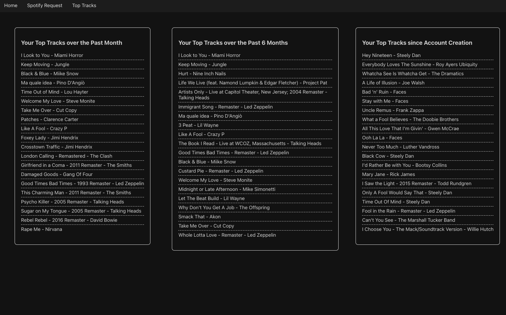
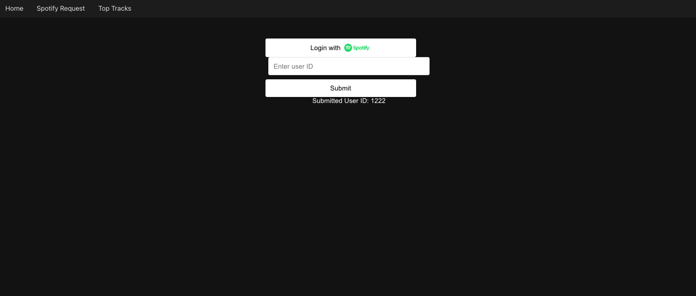
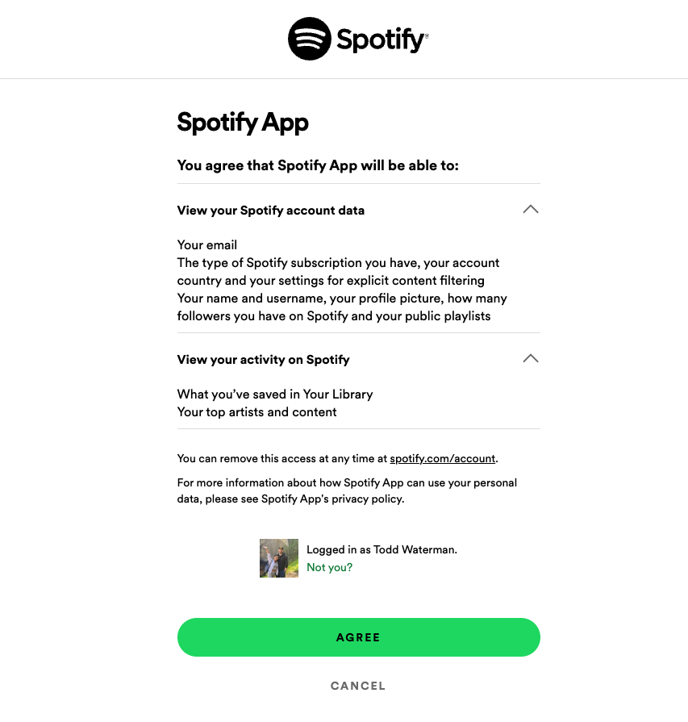

# Music App

## Overview
This web application allows users to connect to their Spotify account and analyze their listening patterns. It provides insights into users' top tracks over different time periods and is designed to offer more interactive features in the future.

## Features

### Frontend
- **Technology**: Built with React (TypeScript) for a dynamic and responsive user experience.
- **Spotify Authentication**: Users can authenticate with their Spotify account to access personalized data.
- **Data Visualization**: Displays user's top tracks in the short term, medium term, and long term.
- **Upcoming Features**:
  - Additional views of various Spotify data.
  - Social features to add friends and compare listening habits.
  - Functionality to share songs with friends.
  - Integration with Apple Music.

### Backend
- **Technology**: Developed using Spring Boot (Java), ensuring robust backend processing.
- **API Integration**: Handles all interactions with the Spotify API.
- **Data Processing**: Refactors Spotify data for frontend utilization.
- **Database**: Currently uses an in-memory database, with plans to migrate to Postgres.
- **Future Enhancements**:
  - Implementation of data pipelines for efficient data processing from Spotify.
  - Reduced latency by minimizing direct API calls for each request.

## Top Tracks Page
Here's a look at the Top Tracks page:

## Spotify Login Workflow

First, click "Log in with Spotify":

This then redirects you to Spotify where you give the appropriate permissions:

